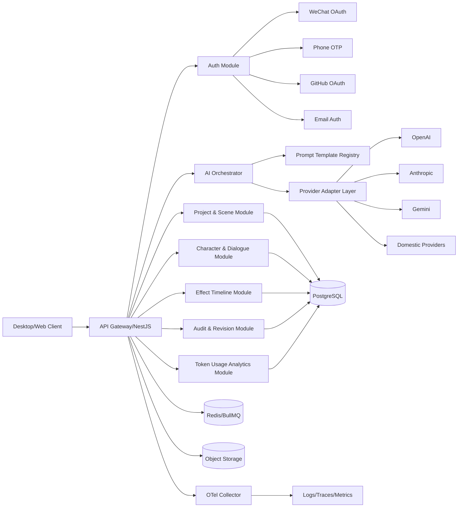
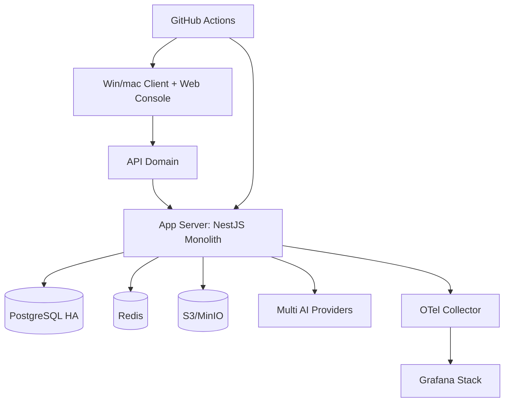
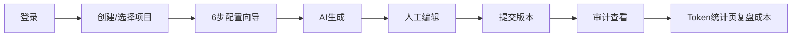

# AIGame Studio Copilot 0-1 项目规划与初步 UI 方案

调研时间：2026-03-06


## 项目名称/类型
- 项目名称：`AIGame Studio Copilot`
- 项目类型：跨平台桌面应用（Windows/macOS）+ Web 管理后台 + AI 协作创作平台（角色画面/台词/动作效果）


## 项目说明
面向游戏策划、美术、叙事设计和技术团队，提供“配置向导 -> AI 生成 -> 人工改稿 -> 版本可回滚 -> 审计可追溯”的一体化创作工作流。


## 1. 核心业务目标与关键功能需求


### 核心业务目标（一句话）
把“游戏角色与剧情片段”从想法到可编辑成品的周期，从天级压缩到小时级，并且全程可追责、可回滚。


### 关键功能需求
1. 登录后可保存项目、场景、角色、台词、动作效果。
2. 配置页分步向导，完成世界观、风格、角色设定、文本风格、输出约束。
3. 可选择画面和文本生成策略，并开始 AI 协作。
4. 支持对 AI 给出的角色图、台词、动作效果进行细粒度修改。
5. 每次 AI 调用与人工编辑都可审计（谁、何时、改了什么、用的什么模型）。
6. 支持版本比较、一键回滚。
7. 页面设计高级、优雅、简洁，动效参考 iPhone 操作系统风格。


### 1a. 登录方式
1. 支持 `微信扫码登录`（企业版可配合组织域名限制与白名单）。
2. 支持 `手机号验证码登录`（含验证码频控、设备风险识别、异常登录告警）。
3. 支持 `GitHub OAuth 登录`（便于研发团队快速接入与 SSO 扩展）。
4. 支持 `邮箱注册/登录`（邮箱验证码或魔法链接，兼容个人创作者场景）。
5. 支持账号绑定与合并：同一用户可绑定微信/GitHub/手机号/邮箱。


### 1b. 多厂商模型 API 接入与 Token 统计
1. 模型层采用 `Provider Adapter` 机制，可并行接入多家厂商（如 OpenAI、Anthropic、Google、火山、阿里等）。
2. 新增 `模型供应商管理`：按项目或租户配置默认厂商、模型、限额、失败回退策略。
3. 新增 `Token 消耗统计单独页面`，支持按时间/项目/成员/模型/供应商查看：
   - 输入 token、输出 token、总 token
   - 调用次数、成功率、平均耗时
   - 成本估算（按供应商单价模板）
   - 告警阈值（预算超限、异常飙升）
4. 审计链与成本链打通：每次模型调用必须有唯一调用 ID，可追溯到账单明细。


## 2. 业务核心逻辑（专家视角）
业务本质是“协作式内容生产线”，不是“单次生成器”。核心闭环：
1. 结构化输入：用户在向导中提供可执行约束。
2. 受控生成：AI 按 schema 输出“可编辑对象”，非自由散文。
3. 人工修订：对角色图、台词、动作做定点修改。
4. 版本治理：每次修改形成 revision，可对比可回滚。
5. 审计归档：AI 调用、人工操作、结果变更三账一致。
6. 成本治理：调用日志实时汇总到 token 统计页，用于预算控制和模型路由优化。


## 3. 系统架构设计思路与推荐方案


### 逻辑架构


### 物理架构


### 关键架构原则
1. 简单优先：模块化单体，边界清晰，先快后拆。
2. 可观测优先：每个请求 trace_id 贯通端到端。
3. 可回滚优先：核心实体版本化，一键回退。
4. AI 调用可审计：模型调用与人工改动统一入审计账。
5. 多供应商可切换：Provider 适配层与业务层解耦。
6. 成本透明：token 和成本指标按租户、项目、成员可追踪。


## 4. 架构落地产物


### 4.1 项目目录结构
```text
aigame-studio/
  apps/
    desktop-tauri/
    web-console/
    api-server/
    worker/
  packages/
    ui-kit/
    domain-types/
    prompt-templates/
    provider-adapters/
    eslint-config/
    tsconfig/
  infra/
    docker/
    k8s/
    terraform/
  docs/
    adr/
    api/
    runbooks/
    audit/
  .github/workflows/
```

### 4.2 核心模块接口定义（示例）
```ts
// Auth
POST   /v1/auth/wechat/qr/start
GET    /v1/auth/wechat/qr/poll
POST   /v1/auth/phone/send-code
POST   /v1/auth/phone/verify
GET    /v1/auth/github/start
GET    /v1/auth/github/callback
POST   /v1/auth/email/register
POST   /v1/auth/email/login

// 项目与向导
POST   /v1/projects
POST   /v1/projects/:id/wizard/steps/:stepId
GET    /v1/projects/:id/wizard/status

// AI 协作
POST   /v1/ai/characters/generate
POST   /v1/ai/dialogues/generate
POST   /v1/ai/effects/suggest

// 多厂商与路由策略
GET    /v1/providers
PATCH  /v1/providers/:id/config
POST   /v1/providers/route-test

// Token 统计（独立页面数据源）
GET    /v1/usage/tokens/overview
GET    /v1/usage/tokens/trend
GET    /v1/usage/tokens/by-model
GET    /v1/usage/tokens/by-provider
GET    /v1/usage/tokens/by-user

// 人工修订
PATCH  /v1/characters/:id
PATCH  /v1/dialogues/:id
PATCH  /v1/effects/:id

// 版本与回滚
POST   /v1/revisions/commit
POST   /v1/revisions/:id/rollback
GET    /v1/revisions/diff

// 审计
GET    /v1/audit/ai-calls
GET    /v1/audit/user-actions
```

### 4.3 示例配置文件
```yaml
app:
  env: production
  region: ap-east-1

auth:
  enable_wechat_qr: true
  enable_phone_otp: true
  enable_github_oauth: true
  enable_email_login: true

ai:
  provider_default: openai
  model_text: gpt-5.4
  model_image: gpt-image-1
  timeout_ms: 45000
  structured_output: true
  max_retry: 2
  fallback_order: [anthropic, gemini]

usage:
  token_stats_enabled: true
  budget_daily_usd: 300
  budget_monthly_usd: 6000
  alert_threshold_percent: 80

audit:
  enabled: true
  redact_pii: true
  store_prompt_hash: true
  retention_days: 180

feature_flags:
  enable_effect_timeline_v2: false
  enable_realtime_collab: false
```

### 4.4 基础 CI/CD 配置示例
```yaml
name: ci
on: [push, pull_request]

jobs:
  test:
    runs-on: ubuntu-latest
    steps:
      - uses: actions/checkout@v4
      - uses: actions/setup-node@v4
        with: { node-version: 22 }
      - run: npm ci
      - run: npm run lint
      - run: npm run test

  build_desktop:
    strategy:
      matrix:
        os: [windows-latest, macos-latest]
    runs-on: ${{ matrix.os }}
    steps:
      - uses: actions/checkout@v4
      - uses: dtolnay/rust-toolchain@stable
      - uses: actions/setup-node@v4
        with: { node-version: 22 }
      - run: npm ci
      - run: npm run build:desktop
```


### 4.5 风险检查清单

1. 四种登录方式是否统一账号体系与风控策略。
2. AI 输出不符合 schema 时是否自动重试并记录失败原因。
3. 回滚是否能恢复画面、台词、动作三类数据一致性。
4. 审计表是否可按 project/user/model/time 快速检索。
5. Token 统计页是否支持账单核对与异常告警。
6. Win/mac 安装包是否完成签名和完整性校验。
7. 关键接口是否做限流、鉴权、重放防护。
8. 日志是否脱敏并带 trace_id。


## 5. 实施路线图与交付标准


### MVP 阶段（0-10 周）
1. 交付：四种登录、项目管理、配置向导、AI 生成、人工编辑、版本回滚、审计页、token 统计页。
2. 标准：P95 非生成接口 < 800ms；生成任务成功率 > 95%；严重缺陷 0 个。
3. 用户验证：10-20 位内测用户，连续两周留存 > 35%。

### 增长阶段（10-20 周）
1. 交付：团队协作、模板市场、批量生成、模型路由策略、权限分层。
2. 标准：项目创建到首个可用角色场景 < 15 分钟。
3. 运营：支持 200+ 活跃项目并发。

### 稳定阶段（20 周+）
1. 交付：企业审计导出、SLA、灾备演练、供应商故障自动切换。
2. 标准：月可用性 99.9%，审计检索 3 秒内返回。


## 6. UI 设计演示

> 目的：在“审核与方案评估”前，先验证关键界面是否可支撑核心业务路径，并确保可被技术架构实现。


### 6.1 关键界面原型输出要求
1. 若可用设计工具（如 Figma），需输出登录页、向导页、协作工作台、token 统计页四类核心页面。
2. 若暂无法直接生成设计稿，可先使用 Markdown 原型演示，再补充 AI 生图提示词。
3. 原型必须覆盖核心业务路径，并作为后续开发与测试基准。


### 6.2 核心页面原型（Markdown 线框）
```text
[登录页]
+------------------------------------------------------+
| AIGame Studio Copilot                                |
| [微信扫码登录] [手机号验证码登录]                     |
| [GitHub 登录]  [邮箱注册/登录]                        |
|------------------------------------------------------|
| 安全提示: 首次登录需绑定主账号                         |
+------------------------------------------------------+

[主工作台]
+----------------+--------------------------+-----------+
| 资源树         | 画面预览/时间轴          | 协作面板  |
| 角色/场景/动作 | 角色画面 + 动作效果      | AI建议    |
| 版本           |                          | Prompt参数|
+----------------+--------------------------+-----------+

[模型供应商管理]
+------------------------------------------------------+
| Provider: OpenAI / Anthropic / Gemini / ...         |
| 默认模型 | 回退策略 | 限额 | API Key 状态              |
+------------------------------------------------------+

[Token 消耗统计页（独立）]
+------------------------------------------------------+
| 时间筛选 | 项目筛选 | 用户筛选 | 供应商筛选            |
| 总Token | 总成本 | 调用次数 | 成功率 | 平均耗时           |
| 趋势图(天/周/月) | Top模型排行 | Top用户排行            |
+------------------------------------------------------+
```

### 6.3 参考对象（设计与交互）
1. Linear：信息层级清晰、操作反馈克制。
2. Notion：复杂内容下的编辑流稳定性。
3. Figma：右侧属性面板与对象编辑体验。
4. iOS Human Interface Guidelines：动效节奏与可访问性。


### 6.4 AI 生成设计稿提示词（可直接用于 Midjourney/SDXL/Flux）
1. 登录页提示词：
   `Desktop app login screen for an AI game creation platform, four auth methods (WeChat QR, phone OTP, GitHub OAuth, email sign-in), clean glassmorphism, soft depth, blue-gray palette, high readability, product-level UI, 1440x900`
2. 工作台提示词：
   `Professional creative studio dashboard, left asset tree, center canvas and timeline, right AI assistant panel, elegant motion-ready layout, minimal but premium, desktop productivity UI`
3. Token 统计页提示词：
   `Analytics dashboard for AI token usage, filters by provider/model/user/project, trend charts and KPI cards, enterprise SaaS style, clear data hierarchy, dark text on light background`


### 6.5 核心交互流程图（PC/Web）



### 6.6 与技术架构对齐说明


1. 前端模块：`auth`、`wizard`、`studio`、`audit`、`usage-analytics` 与后端模块一一对应。
2. API 对齐：每个页面均有明确接口集合，避免“先做 UI 再补 API”导致返工。
3. 迭代同步：设计稿变更必须附带 API 影响说明与埋点更新。


### 6.7 移动 App 扩展说明（仅在未来转移动端时启用）
1. 首页功能优先级：项目入口 > 最近编辑 > 快速生成 > 通知与审计提醒。
2. 核心路径：注册登录、主任务流、设置；并标注离线能力、推送机制等约束。
3. iOS/Android 差异：导航规范、权限申请时机、后台保活策略分别适配。
4. UI 组件库建议：优先可复用设计系统（如 React Native + Tamagui 或 Flutter + Material 3 定制）。
5. 与架构对齐：移动端模块划分、API 复用策略与埋点标准保持一致。


### 6.8 PC/Web 适用说明（当前项目）
1. 当前为 PC/Web 优先，不强制输出移动端“功能选取说明”。
2. 重点交付界面布局说明、核心页面流程图、组件设计规范。
3. 验证重点是交互逻辑与数据展示合理性。


## 7. 审核与方案评估（模拟架构评审）


### 从反对方视角批判
1. 模块化单体后期可能形成性能瓶颈。
2. Tauri + Web 技术栈在重图形编辑场景可能不如原生引擎。
3. 外部 AI 供应商依赖可能带来成本与稳定性风险。


### 3 个可能导致失败的点
1. 用户感知“结果不够可控”，导致留存低。
2. 审计链不完整，企业客户无法上线。
3. 多供应商接入复杂度失控，维护成本过高。


### 替代架构与兜底方案
1. 替代架构 A：Web SaaS + 浏览器端。
2. 替代架构 B：Unity 插件优先。
3. 兜底最小环境依赖：`Tauri + 单后端 + PostgreSQL + 单一模型供应商`，目标 4 周内可演示端到端闭环。


### 从安全性、效率和成本角度规范 AI 协作编程
1. 安全：AI 代码必须经过静态扫描、依赖审计和人工评审后合并。
2. 效率：AI 生成代码必须绑定任务号和验收用例。
3. 成本：设置 token/调用预算上限，默认低成本模型，关键路径再升配。
4. 合规：禁止将明文密钥、生产隐私数据输入外部模型。
5. 审计：需求、代码、测试、发布全链路可追踪。


## 8. 专家视角总结、效果预演与调研来源


### 8.1 专家视角总结
1. 首版成败关键不在“模型能力上限”，在“可控生产闭环”是否跑通。
2. 登录与账号体系必须一次设计到位，否则后续组织协作与审计会反复返工。
3. 多厂商模型接入的价值不只是可用性，更是成本和稳定性的长期博弈能力。
4. token 统计页必须从 MVP 就上线，否则无法做真实的 ROI 决策。


### 8.2 效果预演（上线 30 天预期）
1. 创作链路效率：从“构思到第一版可编辑内容”时间缩短 40%~60%。
2. 审计与复盘效率：问题定位时长下降 50% 以上。
3. 成本透明度：团队可在周维度发现异常 token 消耗并调整路由策略。
4. 风险前提：需保证埋点完整、审计字段稳定、统计口径一致。


### 8.3 调研来源（用于后续复核）


1. https://v2.tauri.app/start/
2. https://www.electronjs.org/docs/latest/tutorial/process-model
3. https://www.electronjs.org/docs/latest/tutorial/security
4. https://docs.flutter.dev/platform-integration/desktop
5. https://developer.apple.com/design/human-interface-guidelines/
6. https://developer.apple.com/design/human-interface-guidelines/accessibility
7. https://platform.openai.com/docs/guides/text
8. https://platform.openai.com/docs/guides/tools
9. https://platform.openai.com/docs/guides/structured-outputs
10. https://www.postgresql.org/docs/current/ddl-rowsecurity.html
11. https://opentelemetry.io/docs/concepts/signals/logs/
12. https://opentelemetry.io/docs/concepts/signals/traces/
13. https://docs.github.com/en/actions/how-tos/using-github-hosted-runners/using-github-hosted-runners
14. https://www.nist.gov/publications/artificial-intelligence-risk-management-framework-ai-rmf-10
15. https://www.nist.gov/publications/artificial-intelligence-risk-management-framework-generative-artificial-intelligence
16. https://github.com/OWASP/ASVS
17. https://www.scenario.com/
18. https://ludo.ai/features
19. https://www.convai.com/
20. https://docs.convai.com/
21. https://inworld.ai/
22. https://docs.inworld.ai/
23. https://docs.github.com/en/apps/oauth-apps/building-oauth-apps/authorizing-oauth-apps
24. https://developers.weixin.qq.com/doc/oplatform/en/
